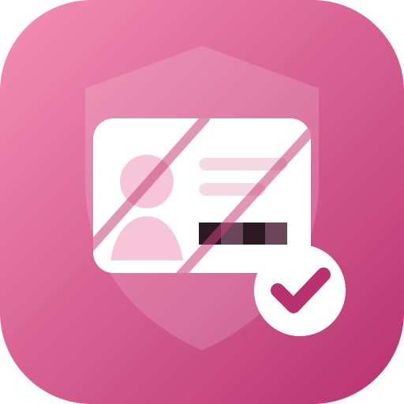
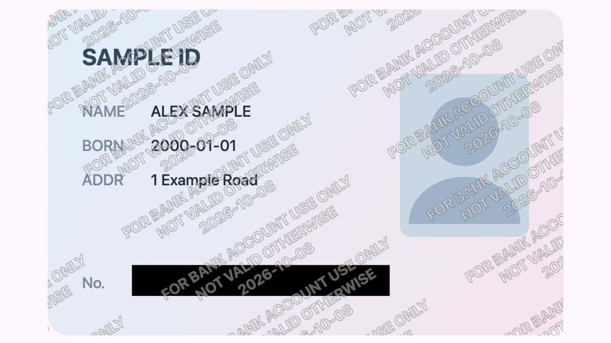
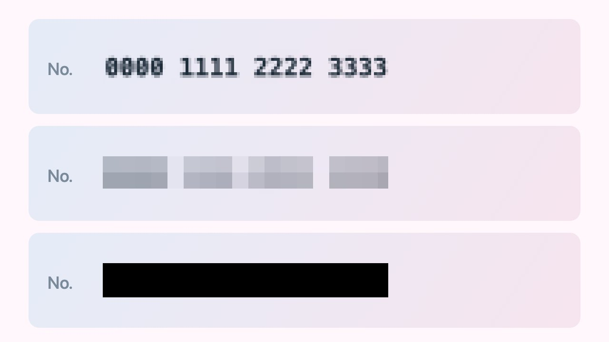
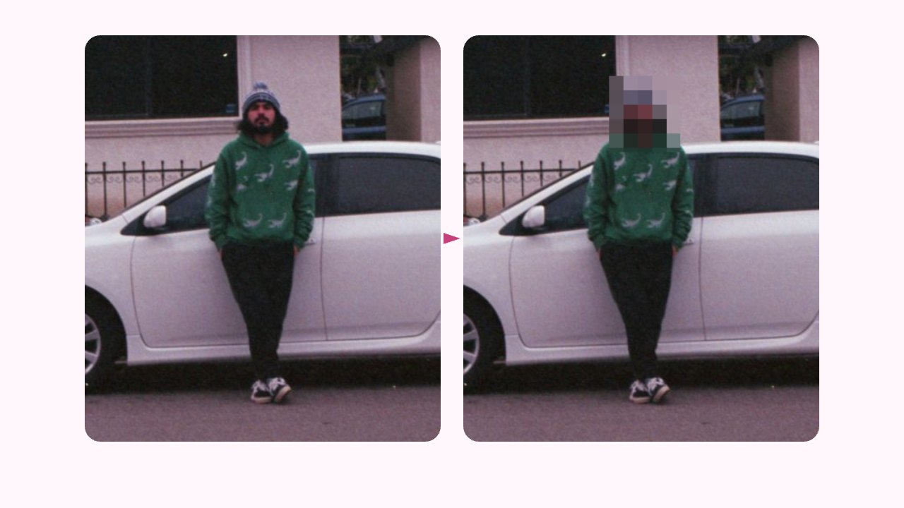
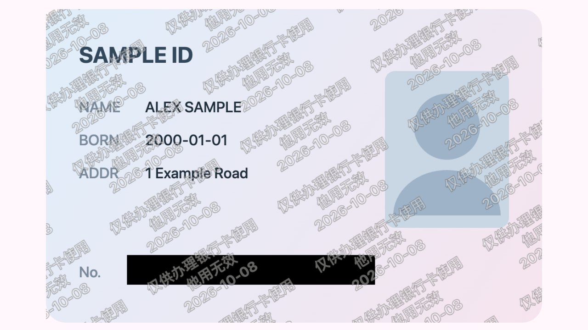

<p align="center"></p>

<h1 align="center">SafeMark · 安心水印</h1>

<p align="center">
Watermark ID copies and pixelate private details — entirely in the browser.<br>
身份证/证件照加「仅供XX使用」防盗水印 + 拖框打马赛克，全程本地处理，不上传。
</p>

<p align="center">
<a href="https://cv.cm/en/watermark/"><b>Open the watermark tool</b></a> ·
<a href="https://cv.cm/en/mosaic/"><b>Open the mosaic tool</b></a> ·
<a href="https://cv.cm/zh-cn/watermark/">在线加水印</a> ·
<a href="https://cv.cm/zh-cn/mosaic/">在线打马赛克</a>
</p>



This repository holds the open-source canvas engine behind **[cv.cm watermark](https://cv.cm/en/watermark/)** and **[cv.cm mosaic](https://cv.cm/en/mosaic/)**. The hosted tools add batch import, ZIP export, EXIF stripping, a sample ID, and 8 languages — still with **no upload**: every pixel stays in your tab.

## Features

- **For-use-only ID watermark** — tile “For [org] use only · not valid otherwise · date” across the whole card, over the portrait, so a cropped corner can't remove it.
- **Drag-to-redact** — black box for ID / card numbers and QR codes, mosaic for faces and plates. Mosaic cells are the exact block mean written back into the pixels, not a translucent overlay.
- **Text or logo marks** — corner, centered, or tiled; font, size, opacity, rotation, spacing.
- **Private by design** — Canvas 2D only. No server, no account, nothing to leak.

## Why a black box for numbers?

A fine mosaic can leave digits readable. A coarse mosaic or a solid box cannot.





## Use the engine

`src/safemark.ts` is a dependency-free TypeScript module for the browser.

```ts
import { renderWatermark } from "./safemark";

const img = await createImageBitmap(file);
const canvas = renderWatermark(img, img.width, img.height, {
  // 0–1 ratios of the image
  redactions: [{ x: 0.16, y: 0.78, w: 0.5, h: 0.09, mode: "black" }],
  mosaicRatio: 0.03,
  text: {
    text: "FOR BANK ACCOUNT USE ONLY\nNOT VALID OTHERWISE\n2026-10-08",
    fontFamily: "system-ui, sans-serif",
    fontWeight: "700",
    fontSizeRatio: 0.045,
    color: "#ffffff",
    opacity: 0.38,
    rotate: -32,
    stroke: true,
    strokeColor: "#1c1916",
  },
  logo: null,
  position: { mode: "anchor", anchor: "br" },
  tiled: true,
  tileGapRatio: 0.08,
});
canvas.toBlob((blob) => { /* download */ }, "image/jpeg", 0.92);
```

Exports: `renderWatermark`, `pixelate`, `redactionBox`, `mosaicCell`, `tilePitch`, `boxAtAnchor`, `fitExportSize`.

## Guides

- [How to watermark an ID copy](https://cv.cm/en/learn/watermark-id-copy/) · [身份证复印件怎么加水印](https://cv.cm/zh-cn/learn/watermark-id-copy/)
- [How to pixelate part of a photo](https://cv.cm/en/learn/mosaic-photo/) · [怎么给图片打马赛克](https://cv.cm/zh-cn/learn/mosaic-photo/)
- [How to add a watermark to a photo](https://cv.cm/en/learn/add-watermark/) · [怎么给照片加水印](https://cv.cm/zh-cn/learn/add-watermark/)

## 中文说明

办银行卡、租房、入职经常要发身份证照片。**安心水印**让证件照离开设备前，先变成「只能用于这一件事」的副本：

1. 打开 [cv.cm/zh-cn/watermark](https://cv.cm/zh-cn/watermark/)，拖入证件照片（或点「用示例证件试试」）。
2. 点「证件防盗用」，把 XX 改成对象和用途，例如「仅供办理XX银行卡使用」，保留日期。
3. 打开「打码」，选「黑块」盖住对方不需要的栏位；人脸、车牌可用[马赛克](https://cv.cm/zh-cn/mosaic/)。
4. 下载后放大到 100% 检查。



水印能降低盗用风险，但不是法律保证；部分窗口仍要求无水印复印件，请先确认。

## More browser tools

SafeMark is part of [cv.cm](https://cv.cm/) — free on-device tools: [merge PDF](https://cv.cm/en/merge-pdf/), [compress PDF](https://cv.cm/en/compress-pdf/), [HEIC to JPG](https://cv.cm/en/convert/heic-to-jpg/), [remove EXIF](https://cv.cm/en/exif/), [crop](https://cv.cm/en/crop/), [resize](https://cv.cm/en/resize/), [QR code](https://cv.cm/en/qr/). Source: [mantoufan/cvcm](https://github.com/mantoufan/cvcm).

## License

MIT
